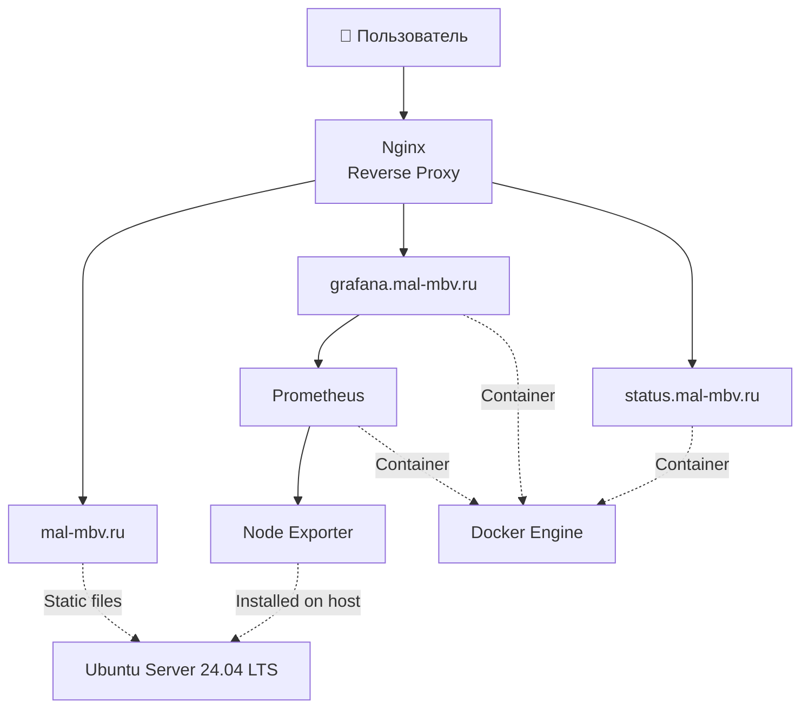

# VPS Infrastructure Platform

Современная инфраструктура для размещения веб-приложений на VPS с использованием Docker, Nginx и собственного стека мониторинга.

Проект представляет собой полностью настроенный сервер с HTTPS, обратным прокси, автоматическим развёртыванием через GitHub Actions, мониторингом инфраструктуры и сервисов, а также защищенным удаленным доступом через собственный VPN.


---

# Архитектура



---

# Реализовано

- размещение веб-приложений на VPS;
- Reverse Proxy на базе Nginx;
- HTTPS для всех сервисов с использованием Let's Encrypt;
- контейнеризация сервисов с помощью Docker Compose;
- настройка собственного VPN-сервера на базе Amnezia VPN;
- защищенное подключение к инфраструктуре с различных устройств через приложение Amnezia;
- мониторинг ресурсов сервера через Prometheus и Node Exporter;
- визуализация метрик в Grafana;
- мониторинг доступности сервисов через Uptime Kuma;
- автоматический деплой через GitHub Actions;
- защита SSH с использованием Fail2Ban;
- изоляция внутренних сервисов от внешней сети;
- подробная техническая документация проекта.

---

# Используемые технологии

| Категория         | Технологии              |
| ----------------- | ----------------------- |
| ОС                | Ubuntu Server 24.04 LTS |
| Web Server        | Nginx                   |
| Контейнеризация   | Docker, Docker Compose  |
| CI/CD             | GitHub Actions          |
| Мониторинг        | Prometheus              |
| Экспорт метрик    | Node Exporter           |
| Визуализация      | Grafana                 |
| Uptime Monitoring | Uptime Kuma             |
| SSL               | Let's Encrypt           |
| Защита SSH        | Fail2Ban                |
| Контроль версий   | Git, GitHub             |
| VPN-доступ        | Amnezia VPN             |

---

# Развёрнутые сервисы

| Адрес                  | Назначение    |
| ---------------------- | ------------- |
| **mal-mbv.ru**         | основной сайт |
| **grafana.mal-mbv.ru** | Grafana       |
| **status.mal-mbv.ru**  | Uptime Kuma   |

---

# CI/CD

Для автоматизации развёртывания используется GitHub Actions.

После каждого изменения в основной ветке репозитория автоматически выполняется:

```text
        Push в main
             │
             ▼
       GitHub Actions
             │
             ▼
     Подключение по SSH
             │
             ▼
          git pull
             │
             ▼
   Обновление контейнеров
             │
             ▼
Проверка успешного выполнения
```

Такой подход позволяет публиковать изменения без ручного копирования файлов на сервер и обеспечивает единый процесс развёртывания.

---

# Скриншоты

### Grafana


---

### Uptime Kuma


---

# Структура репозитория

```text
vps-infrastructure-platform
│
├── README.md
│   └── обзор проекта
│
├── docs/
│   ├── architecture.md
│   │   └── архитектура инфраструктуры
│   ├── deployment.md
│   │   └── процесс развёртывания
│   ├── monitoring.md
│   │   └── стек мониторинга
│   └── security.md
│       └── безопасность сервера
│
├── docker/
│   ├── docker-compose.yml
│   │   └── запуск контейнеров
│   └── README.md
│       └── описание контейнеров
│
├── nginx/
│   ├── README.md
│   │   └── описание конфигурации
│   └── sites/
│       ├── site.conf
│       ├── grafana.conf
│       └── status.conf
│
├── diagrams/
│   ├── architecture.mmd
│   ├── deployment-flow.mmd
│   ├── monitoring.mmd
│   ├── request-flow.mmd
│   └── README.md
│
└── screenshots/
    ├── 01-security/
    ├── 02-infrastructure/
    ├── 03-site-deployment/
    ├── 04-reverse-proxy/
    ├── 05-monitoring/
    ├── 06-uptime-kuma/
    ├── 07-cicd/
    └── 08-security-hardening/
```

---

# Документация

Подробное описание инфраструктуры находится в каталоге `docs`.

| Документ            | Содержание                                              |
| ------------------- | ------------------------------------------------------- |
| **architecture.md** | архитектура инфраструктуры и взаимодействие компонентов |
| **deployment.md**   | процесс развёртывания и обновления сервисов             |
| **monitoring.md**   | Prometheus, Grafana, Node Exporter и Uptime Kuma        |
| **security.md**     | SSH, Firewall, Fail2Ban и HTTPS                         |

---

# Планы по развитию

- централизованный сбор логов через Loki;
- Alertmanager для уведомлений в Telegram;
- резервное копирование данных Grafana и Uptime Kuma;
- мониторинг WireGuard через exporter;
- автоматическое обновление контейнеров;
- управление инфраструктурой через Terraform или Ansible.
