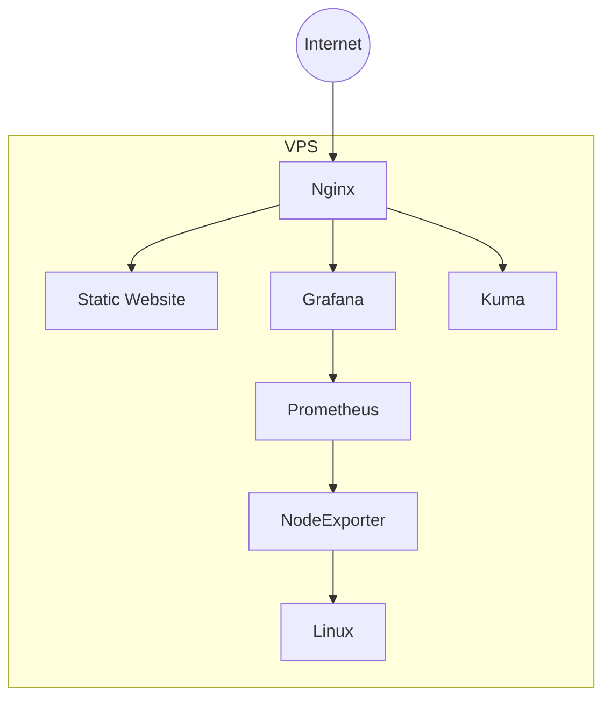
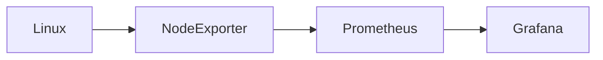
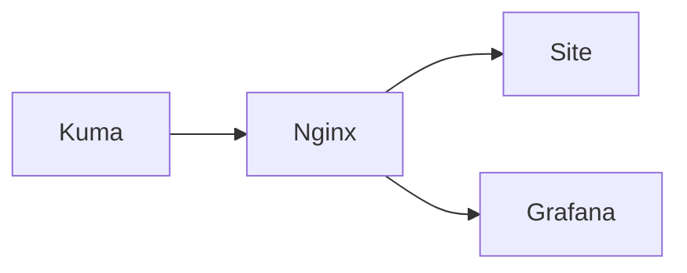

# Архитектура

## Обзор

Проект представляет собой инфраструктуру VPS-сервера, предназначенную для размещения веб-приложений и сервисов мониторинга.

В основе архитектуры лежит разделение ответственности между компонентами:

- **Ubuntu Server** — базовая операционная система;
- **Nginx** — единая точка входа для HTTP(S)-трафика;
- **Docker Compose** — управление контейнерами;
- **Prometheus** — сбор метрик;
- **Grafana** — визуализация состояния инфраструктуры;
- **Node Exporter** — экспорт системных метрик;
- **Uptime Kuma** — мониторинг доступности сервисов;
- **GitHub Actions** — автоматический деплой изменений.

---

# Общая схема



---

# Компоненты

## Ubuntu Server

Базовая операционная система сервера.

Отвечает за:

- запуск сервисов;
- управление сетью;
- файловую систему;
- работу Docker;
- безопасность системы.

---

## Nginx

Используется в качестве reverse proxy и веб-сервера.

Основные задачи:

- обслуживание статического сайта;
- HTTPS (Let's Encrypt);
- перенаправление HTTP → HTTPS;
- маршрутизация запросов между сервисами;
- скрытие внутренних портов контейнеров.

Все пользовательские запросы проходят через Nginx.

---

## Docker Compose

Все сервисы запускаются в отдельных контейнерах.

Это обеспечивает:

- изоляцию зависимостей;
- простое обновление;
- воспроизводимость окружения;
- быстрое восстановление после сбоя.

---

## Prometheus

Prometheus регулярно опрашивает источники метрик.

В проекте используется:

- Node Exporter.

Интервал сбора:

```
15 секунд
```

---

## Node Exporter

Предоставляет системные метрики Linux.

Например:

- загрузка CPU;
- использование памяти;
- файловые системы;
- сетевой трафик;
- нагрузка на диски.

Node Exporter не хранит данные — он только предоставляет их Prometheus.

---

## Grafana

Используется для визуализации метрик.

На дашбордах отображаются:

- CPU;
- RAM;
- Disk;
- Filesystem;
- Network;
- Uptime;
- Load Average.

Grafana получает данные напрямую из Prometheus.

---

## Uptime Kuma

Отвечает за внешний мониторинг доступности сервисов.

Проверяет:

- основной сайт;
- Grafana;
- собственную доступность.

Мониторинг выполняется посредством HTTP(S)-запросов.

---

## GitHub Actions

Используется для автоматического развертывания изменений.

Типовой процесс:

```text
  git push
      │
      ▼
GitHub Actions
      │
      ▼
     SSH
      │
      ▼
     VPS
      │
      ▼
   git pull
      │
      ▼
обновление проекта
```

Это исключает необходимость ручного подключения к серверу при каждом обновлении.

---

# Поток пользовательского запроса

При открытии сайта пользователь проходит следующий путь:

```text
   Браузер
      │
      ▼
     DNS
      │
      ▼
     VPS
      │
      ▼
    Nginx
      │
      ▼
Статический сайт
```

Для Grafana путь отличается только конечным сервисом:

```text
   Браузер
      │
      ▼
    Nginx
      │
      ▼
 Reverse Proxy
      │
      ▼
Grafana Container
```

---

# Поток сбора метрик



1. Node Exporter считывает состояние системы.
2. Prometheus получает метрики через HTTP.
3. Grafana запрашивает данные у Prometheus.
4. Пользователь видит готовые графики.

---

# Поток мониторинга доступности



Каждая проверка проходит тот же путь, что и реальные пользователи.

Благодаря этому фиксируются проблемы уровня:

- DNS;
- HTTPS;
- Reverse Proxy;
- недоступность контейнера;
- ошибки приложения.

---

# Принципы архитектуры

При проектировании инфраструктуры использовались следующие принципы:

- разделение ответственности между сервисами;
- минимизация количества открытых портов;
- контейнеризация приложений;
- единая точка входа через Nginx;
- автоматизация развертывания;
- мониторинг состояния инфраструктуры;
- возможность дальнейшего масштабирования.

Архитектура позволяет без существенных изменений добавлять новые сервисы, веб-приложения и инструменты мониторинга.
