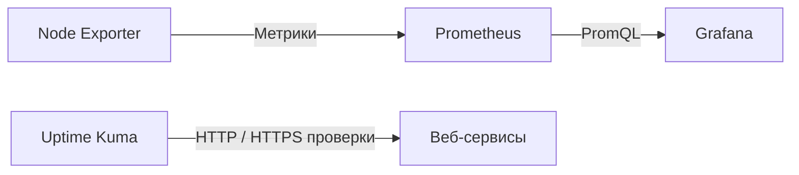

# Мониторинг

## Назначение

Мониторинг предназначен для контроля состояния инфраструктуры и своевременного обнаружения неисправностей.

В проекте используются два независимых подхода.

| Инструмент    | Назначение                    |
| ------------- | ----------------------------- |
| Prometheus    | Сбор метрик                   |
| Grafana       | Визуализация                  |
| Node Exporter | Метрики Linux                 |
| Uptime Kuma   | Проверка доступности сервисов |

---

# Архитектура мониторинга



---

# Prometheus

Prometheus периодически опрашивает Node Exporter.

Интервал опроса:

```
15 секунд
```

Полученные данные сохраняются во внутреннем хранилище временных рядов.

---

# Node Exporter

Экспортирует основные системные показатели.

Основные метрики:

- загрузка CPU;
- использование RAM;
- файловые системы;
- свободное место;
- нагрузка на диски;
- сетевой трафик;
- uptime сервера.

Node Exporter не хранит данные самостоятельно — он только предоставляет их Prometheus.

---

# Grafana

Grafana подключается к Prometheus как к источнику данных.

Используемые дашборды позволяют отслеживать:

- CPU Usage;
- Memory Usage;
- Filesystem Usage;
- Network Traffic;
- Disk I/O;
- System Load;
- Uptime.

---

# Uptime Kuma

В отличие от Prometheus контролирует доступность сервисов с точки зрения пользователя.

Проверяются:

- https://mal-mbv.ru
- https://grafana.mal-mbv.ru
- https://status.mal-mbv.ru

Каждый монитор регулярно выполняет HTTP(S)-запрос.

Если сервис перестает отвечать или возвращает ошибку, Uptime Kuma фиксирует инцидент.

---

# Типовые сценарии диагностики

## Высокая загрузка CPU

Используются графики Grafana:

- CPU Usage
- Load Average

---

## Заканчивается место на диске

Используются:

Filesystem Usage

---

## Сайт недоступен

Проверяется:

1. Uptime Kuma
2. Nginx
3. Docker
4. Логи приложения

---

## Grafana не открывается

Проверяются:

- контейнер Grafana;
- доступность Prometheus;
- конфигурация Nginx.

---

# Полезные команды

Проверка Prometheus:

```bash
curl http://127.0.0.1:9090/-/healthy
```

Проверка целей Prometheus:

```bash
curl http://127.0.0.1:9090/api/v1/targets
```

Проверка Node Exporter:

```bash
curl http://localhost:9100/metrics
```

Проверка контейнеров:

```bash
docker ps
```

Просмотр логов:

```bash
docker logs prometheus

docker logs grafana

docker logs uptime-kuma
```
